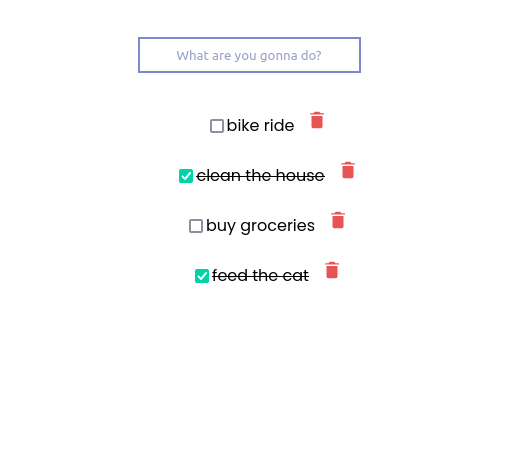

# Full Stack Developer Test


Tecnologias que utilizei:

- React.js
- Node.js
- TypeScript
- Express.js
- MongoDB
- Mongoose
- Axios
- react-router-dom
- react-icons
- bcryptjs
- JSON Web Token

## Demonstração

#### Página de login


####


Front-End hospedado em [https://test-dev-fullstack-todo.vercel.app](https://test-dev-fullstack-todo.vercel.app)

Back-End hospedado em [https://todosapitest.herokuapp.com](https://todosapitest.herokuapp.com)

## Instruções para rodar o app localmente

1. Instale as dependências do projeto:
```bash
npm install
```
2. Execute aplicação:
```bash
npm run dev
```